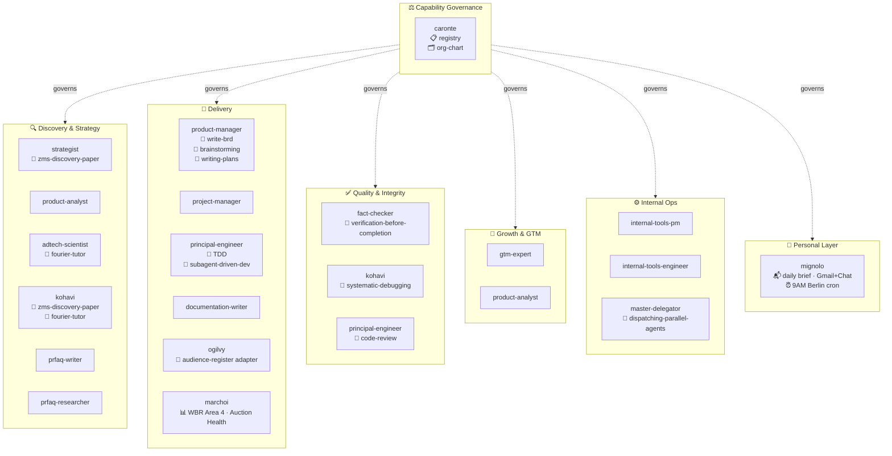
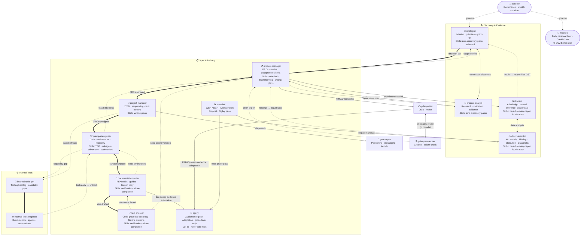
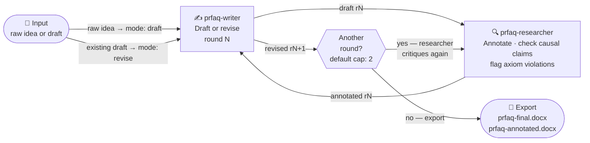
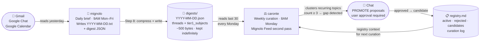

# Agent Org Chart

---

## Diagram 1 — Functional Clusters

---

## Diagram 2 — Delivery Flow & Feedback Loops

Solid arrows = main delivery path. Dashed arrows = feedback and loop-back. Labels name the trigger for each loop.

---

## Diagram 3 — PRFAQ Critique Loop

---

## Diagram 4 — Mignolo → Caronte Feedback Loop

How Caronte learns what's missing from the stack by watching what you actually do each day.

---

## Agent Reference

| Agent | Role | Invoke when | Skills | Model |
|---|---|---|---|---|
| caronte | HR director · capability auditor | Considering a new skill or agent; every Monday (cron) | registry · org-chart | opus |
| master-delegator | Orchestrator | Complex goals needing parallel sub-tasks | dispatching-parallel-agents | — |
| strategist | Mission setter · go/no-go | Any new initiative; direction unclear | zms-discovery-paper · write-brd | opus |
| product-analyst | Evidence · research · validation | Claim needs proof; problem space unclear | zms-discovery-paper · competitive-analysis · analyze-feedback · market-sizing | sonnet |
| product-manager | PRDs · stories · acceptance criteria | Direction set; spec needed | brainstorming · write-brd · writing-plans | opus |
| project-manager | JTBD decomposition · sequencing | PRD exists; work needs queuing | writing-plans | sonnet |
| principal-engineer | Architecture · code · feasibility | Any code-writing or technical design task | TDD · systematic-debugging · verification-before-completion · code-review · subagent-driven-dev · using-git-worktrees | opus |
| documentation-writer | READMEs · guides · API refs | New surface shipped; GTM needs assets | verification-before-completion | sonnet |
| fact-checker | Code-grounded accuracy review | Doc about system ready for final review | verification-before-completion | opus |
| kohavi | A/B testing · causal inference | Experiment design; result interpretation; causal claim | systematic-debugging · zms-discovery-paper · fourier-tutor · analyze-test | sonnet |
| adtech-scientist | Bidding · attribution · ML · Databricks | Any adtech analytical or modeling question | zms-discovery-paper · fourier-tutor · write-query · analyze-cohorts | sonnet |
| prfaq-writer | PRFAQ drafting and revision | PRFAQ loop round — draft or revise | — | sonnet |
| prfaq-researcher | Causal claims · axiom violations | PRFAQ loop round — annotate draft | — | sonnet |
| gtm-expert | Positioning · launch · channels | Project nears ship-readiness | — | sonnet |
| internal-tools-pm | Team tooling backlog | Agent reports a capability gap | — | sonnet |
| internal-tools-engineer | Builds team scripts and automations | internal-tools-pm has a spec ready | — | sonnet |
| ogilvy | Audience-register adapter · prose layer only | Finished document needs rewriting for named stakeholder audience | proofread | sonnet |
| marchoi | Data analyst · WBR Area 4 · Prophet anomaly model · Ogilvy exec pass | Weekly cron fires; any ad-hoc data analysis requested | write-query · analyze-test · analyze-cohorts | sonnet |
| mignolo | Daily personal brief · Gmail+Chat triage · 9AM cron | Daily 9AM cron fires; can be invoked on-demand | — | sonnet |
